# System Architecture Diagram

## Multi-Agent Coding System Architecture

```mermaid
flowchart TB
User["👤 User/Task Input"] --> Orch
 subgraph subGraph0["External Layer"]
        
        LLM["🤖 LLM API<br>Claude/Qwen/OpenRouter"]
        Env["💻 Environment<br>Terminal/Filesystem"]
  end
 subgraph subGraph1["Orchestrator Layer"]
        Orch["🎯 Orchestrator Agent<br>Strategic Coordinator"]
        OrchestratorState["📊 Orchestrator State"]
        TurnHistory["📜 Turn History"]
  end
 subgraph subGraph2["Coordination Hub"]
        Hub["🧠 Orchestrator Hub<br>Central Coordination"]
        ContextStore["💾 Context Store<br>Knowledge Artifacts"]
        TaskStore["📋 Task Store<br>Task Tracking"]
        TaskMgr["⚙️ Task Manager<br>Subagent Launcher"]
  end
 subgraph subGraph3["Agent Management"]
        AgentMgr["👥 Agent Manager<br>Agent Registry"]
        Explorer["🔍 Explorer Subagent<br>Read-only Investigation"]
        Coder["💻 Coder Subagent<br>Implementation Specialist"]
  end
 subgraph subGraph4["Action Handlers"]
        FileHandlers["📁 File Handlers<br>Read/Write/Edit/MultiEdit"]
        SearchHandlers["🔎 Search Handlers<br>Grep/Glob/LS"]
        SubagentHandler["📌 Subagent Handler<br>Launch"]
        ReportHandler["📋 Report Handler"]
        ContextHandler["🔗 Context Handler<br>Add Context"]
        TodoHandler["✅ Todo Handler"]
        NoteHandlers["📝 Note Handlers<br>Scratchpad"]
        BashHandler["⚡ Bash Handler"]
        FinishHandler["🏁 Finish Handler"]
        UserInputHandler["💬 User Input Handler"]
  end
 subgraph subGraph5["Action System"]
        ActionHandler["🔧 Action Handler<br>Action Execution"]
        ActionParser["⚙️ Simple Action Parser<br>XML/YAML Parser"]
        subGraph4
  end
 subgraph subGraph6["Tool Layer"]
        FileMgr["📂 File Manager<br>File I/O Operations"]
        SearchMgr["🔍 Search Manager<br>Grep/Glob/LS"]
        CmdExec["⌨️ Command Env Executor<br>Shell Commands"]
  end
 subgraph subGraph7["Support Systems"]
        SysMsg["📋 System Messages<br>Agent Prompts v0.1"]
        Logger["📊 Turn Logger<br>Structured Logs"]
        LLMClient["🔌 LLM Client<br>Litellm Wrapper"]
  end
    LLMClient <--> LLM
    Orch --> OrchestratorState & TurnHistory & Hub & ActionHandler
    Hub --> ContextStore & TaskStore & TaskMgr
    TaskMgr --> AgentMgr & TaskStore & ContextStore
    AgentMgr --> Explorer & Coder
    Explorer --> ActionHandler
    Coder --> ActionHandler
    ActionHandler --> ActionParser
    ActionParser --> FileHandlers & SearchHandlers & SubagentHandler & ReportHandler & ContextHandler & TodoHandler & NoteHandlers & BashHandler & FinishHandler & UserInputHandler
    SubagentHandler --> TaskMgr
    ContextHandler --> ContextStore
    ReportHandler --> Coder
    FileHandlers --> FileMgr
    SearchHandlers --> SearchMgr
    BashHandler --> CmdExec
    FileMgr --> Env
    SearchMgr --> Env
    CmdExec --> Env

     User:::externalClass
     LLM:::externalClass
     Env:::externalClass
     Orch:::agentClass
     Hub:::hubClass
     ContextStore:::hubClass
     TaskStore:::hubClass
     TaskMgr:::hubClass
     AgentMgr:::hubClass
     Explorer:::agentClass
     Coder:::agentClass
     FileHandlers:::actionClass
     SearchHandlers:::actionClass
     SubagentHandler:::actionClass
     ReportHandler:::actionClass
     ContextHandler:::actionClass
     TodoHandler:::actionClass
     NoteHandlers:::actionClass
     BashHandler:::actionClass
     FinishHandler:::actionClass
     UserInputHandler:::actionClass
     ActionHandler:::actionClass
     ActionParser:::actionClass
     FileMgr:::toolClass
     SearchMgr:::toolClass
     CmdExec:::toolClass
     SysMsg:::supportClass
     Logger:::supportClass
     LLMClient:::supportClass
    classDef agentClass fill:#4a90e2,stroke:#2e5c8a,stroke-width:3px,color:#fff
    classDef hubClass fill:#f39c12,stroke:#d68910,stroke-width:3px,color:#fff
    classDef toolClass fill:#27ae60,stroke:#1e8449,stroke-width:2px,color:#fff
    classDef actionClass fill:#8e44ad,stroke:#6c3483,stroke-width:2px,color:#fff
    classDef supportClass fill:#95a5a6,stroke:#7f8c8d,stroke-width:2px,color:#fff
    classDef externalClass fill:#e74c3c,stroke:#c0392b,stroke-width:3px,color:#fff



```

## Data Flow Diagram

## Component Interaction Map

```mermaid
graph LR
    subgraph "Agent Specialization"
        O[Orchestrator<br/>🚫 No Code Access<br/>✅ Strategic Planning]
        E[Explorer<br/>🚫 No Write Access<br/>✅ Read & Verify]
        C[Coder<br/>✅ Full Access<br/>✅ Implementation]
    end
    
    subgraph "Knowledge Management"
        CS[Context Store<br/>💾 Persistent Memory<br/>📚 Knowledge Artifacts<br/>🔄 Reusable Contexts]
    end
    
    subgraph "Task Orchestration"
        TM[Task Manager<br/>📊 Progress Tracking<br/>🔄 Failure Recovery<br/>📋 Workflow Audit]
    end
    
    subgraph "Communication Protocol"
        R[Report Structure<br/>📝 Task Results<br/>🎯 Context Returns<br/>✅ Status Updates]
    end
    
    O -->|Delegates| E
    O -->|Delegates| C
    E -->|Reports via| R
    C -->|Reports via| R
    R -->|Stores in| CS
    O -->|Queries| CS
    O -->|Manages| TM
    CS -->|Injected into| E
    CS -->|Injected into| C
    
    style O fill:#4a90e2,stroke:#2e5c8a,stroke-width:3px
    style E fill:#27ae60,stroke:#1e8449,stroke-width:3px
    style C fill:#e74c3c,stroke:#c0392b,stroke-width:3px
    style CS fill:#f39c12,stroke:#d68910,stroke-width:3px
    style TM fill:#8e44ad,stroke:#6c3483,stroke-width:3px
    style R fill:#16a085,stroke:#138d75,stroke-width:3px
```

## Action System Architecture

## Context Store Pattern

```mermaid
flowchart TB
    subgraph "Context Lifecycle"
        direction TB
        Create[📝 Context Creation<br/>Orchestrator Specifies]
        Discover[🔍 Discovery<br/>Subagent Investigates]
        Report[📋 Report<br/>Structured Return]
        Store[💾 Store<br/>Persistent Storage]
        Inject[💉 Injection<br/>Into New Tasks]
        Reuse[♻️ Reuse<br/>Knowledge Building]
    end
    
    subgraph "Context Types"
        CodeCtx[📄 Code Context<br/>File Contents<br/>Function Signatures]
        ArchCtx[🏗️ Architecture Context<br/>System Design<br/>Dependencies]
        TestCtx[✅ Test Context<br/>Test Results<br/>Verification]
        BugCtx[🐛 Bug Context<br/>Error Analysis<br/>Root Causes]
        ImplCtx[⚙️ Implementation Context<br/>Changes Made<br/>Approach Used]
    end
    
    Create --> Discover
    Discover --> Report
    Report --> Store
    Store --> Inject
    Inject --> Reuse
    Reuse -.-> Create
    
    Report --> CodeCtx
    Report --> ArchCtx
    Report --> TestCtx
    Report --> BugCtx
    Report --> ImplCtx
    
    style Create fill:#3498db,stroke:#2874a6,stroke-width:2px
    style Store fill:#f39c12,stroke:#d68910,stroke-width:3px
    style Inject fill:#27ae60,stroke:#1e8449,stroke-width:2px
    style Reuse fill:#9b59b6,stroke:#7d3c98,stroke-width:2px
```

## Key Architecture Principles

### 1. **Separation of Concerns**
- **Orchestrator**: Strategy and coordination (no code access)
- **Explorer**: Investigation and verification (read-only)
- **Coder**: Implementation (full write access)

### 2. **Knowledge Accumulation**
- Context Store enables persistent learning
- Each subagent builds on previous discoveries
- No redundant exploration or work

### 3. **Stateless Turn-Based Execution**
- Each turn: LLM → Actions → Execution → Feedback
- Clear state transitions
- Reproducible behavior

### 4. **Forced Delegation Pattern**
- Orchestrator cannot directly access code
- Must delegate through specialized agents
- Encourages proper task decomposition

### 5. **Compound Intelligence**
- Multiple specialized agents working together
- Orchestrated knowledge sharing
- Emergent problem-solving capabilities

