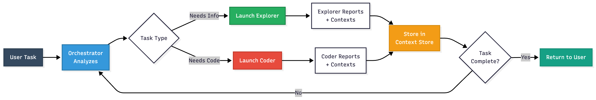

# Agentic Code assistant using Deepagent-style
This is an experimental project implementing an agentic code assistant inspired by Deepagent-style architectures. 
It features a central orchestrator agent that coordinates specialised subagents (explorers and coders) to tackle complex software tasks through strategic delegation, verification, and knowledge sharing.

## How It Works

1. **User** submits a complex coding task
2. **Orchestrator** analyzes and breaks it down
3. **Orchestrator** launches **Explorer** to investigate the codebase
4. **Explorer** reports findings to **Context Store**
5. **Orchestrator** launches **Coder** with all necessary context
6. **Coder** implements changes and reports back
7. **Orchestrator** verifies and returns results to **User**

**Key Innovation**: The **Context Store** enables agents to share knowledge, eliminating redundant work and building compound intelligence.

## System Architecture Overview


## Key Components

### 👤 User
- Submits high-level tasks to the system
- Receives final results from the orchestrator

### 🎯 Orchestrator Agent
**The Strategic Brain**
- **No direct code access** - Forces proper delegation
- Analyzes tasks and creates strategic plans
- Decomposes complex tasks into subtasks
- Manages the Context Store (knowledge base)
- Tracks all tasks via Task Store
- Verifies work through explorer agents

### 🔍 Explorer Agent
**Read-Only Investigation Specialist**
- **Read-only access** to the codebase
- Investigates system behavior
- Verifies implementations
- Runs tests and gathers information
- Creates knowledge artifacts for the Context Store

### 💻 Coder Agent
**Implementation Specialist**
- **Full write access** to the codebase
- Implements features and fixes bugs
- Makes code modifications
- Reports changes back with contexts

### 💾 Context Store
**Persistent Knowledge Base**
- Stores discovered information
- Enables knowledge sharing across agents
- Eliminates redundant work
- Builds compound intelligence

### 📋 Task Store
**Progress Tracker**
- Tracks all subagent tasks
- Maintains task status (pending/completed/failed)
- Enables failure recovery
- Provides audit trail

## Data Flow


## What Makes This System Special

### 🧠 Smart Context Sharing
- **Knowledge Accumulation**: Every discovery becomes a permanent building block
- **No Redundant Work**: Agents never rediscover the same information
- **Focused Execution**: Each agent receives only the contexts it needs

### 🎯 Forced Delegation Pattern
- Orchestrator's lack of code access forces proper task decomposition
- Encourages strategic thinking over quick fixes
- Creates clear separation of concerns

### 🔄 Compound Intelligence
- Multiple specialized agents working together
- Each action builds meaningfully on previous discoveries
- Exponential problem-solving capability through knowledge sharing

### ✅ Built-in Verification
- Explorer agents verify all implementations
- Test execution and validation built into the workflow
- Ensures quality through systematic checking

## Typical Workflow Example

1. **User**: "Add authentication to the API"

2. **Orchestrator**:
    - Analyzes the task
    - Launches Explorer to find existing auth patterns
    - Stores findings in Context Store

3. **Explorer Reports**:
    - Found existing user model
    - Located database configuration
    - Identified auth library in use

4. **Orchestrator**:
    - Launches Coder with all contexts
    - Provides specific implementation instructions

5. **Coder Implements**:
    - Adds auth middleware
    - Updates routes
    - Reports changes with contexts

6. **Orchestrator**:
    - Launches Explorer to verify
    - Checks if tests pass
    - Validates implementation

7. **Explorer Verifies**:
    - Tests run successfully
    - Auth endpoints working
    - Reports confirmation

8. **Orchestrator**: Returns success to user

## Getting started

For dev:
```bash
uv sync
uv pip install -e ".[dev]" 
```

To quickly test various models: See [/test](./test/)
