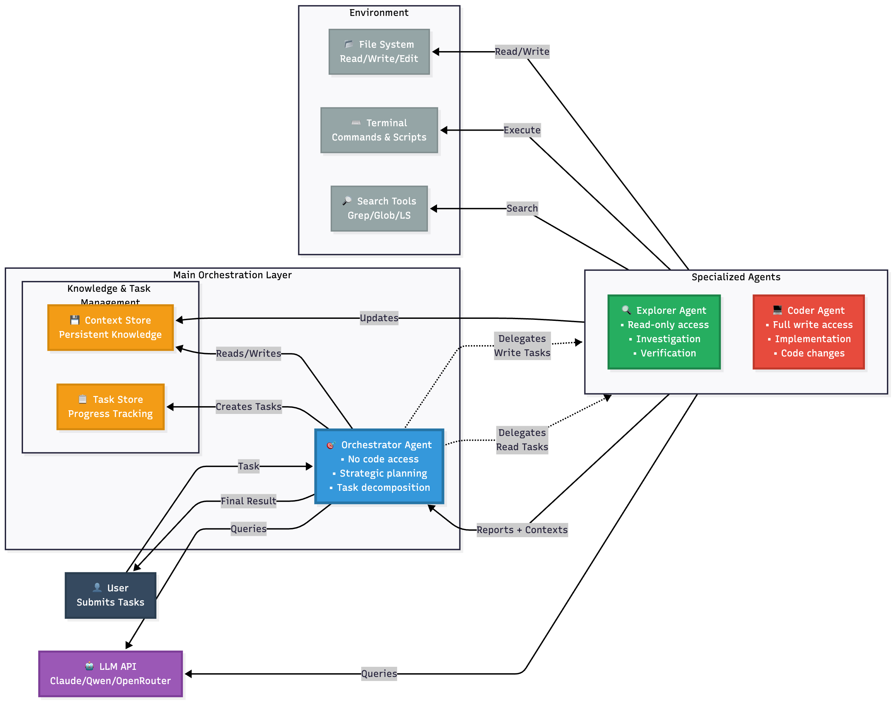

# Agentic Code assistant using Deepagent-style

This is an experimental project implementing an agentic code assistant inspired by Deepagent-style architectures.
Deep Agents are an advanced agent architecture designed for handling complex, multi-step tasks that require sustained
reasoning, tool use, and memory.
Unlike traditional agents that operate in short loops or perform simple tool calls, Deep Agents plan their actions,
manage evolving context, delegate subtasks to specialized sub-agents, and maintain state across long interactions. This
architecture is already powering real-world applications like Claude Code, Deep Research, and Manus.
It features a central orchestrator agent that coordinates specialised subagents (explorers and coders) to tackle complex
software tasks through strategic delegation, verification, and knowledge sharing.

## How It Works

1. **User** submits a complex coding task
2. **Orchestrator** analyzes and breaks it down
3. **Orchestrator** launches **Explorer** to investigate the codebase
4. **Explorer** reports findings to **Context Store**
5. **Orchestrator** launches **Coder** with all necessary context
6. **Coder** implements changes and reports back
7. **Orchestrator** verifies and returns results to **User** or requests further exploration/coding as needed

**Key Innovation**: The **Context Store** enables agents to share knowledge, eliminating redundant work and building
compound intelligence.

## System Architecture Overview




## Getting started

Ensure you set the `LITE_LLM_API_KEY` environment variable. The default model is `openai/gpt-5`.

For dev:

```bash
uv venv
source .venv/bin/activate
uv sync
uv pip install -e ".[dev]" 
python test/real_advanced_task.py
```

To quickly test various models: See [/test](./test/)
