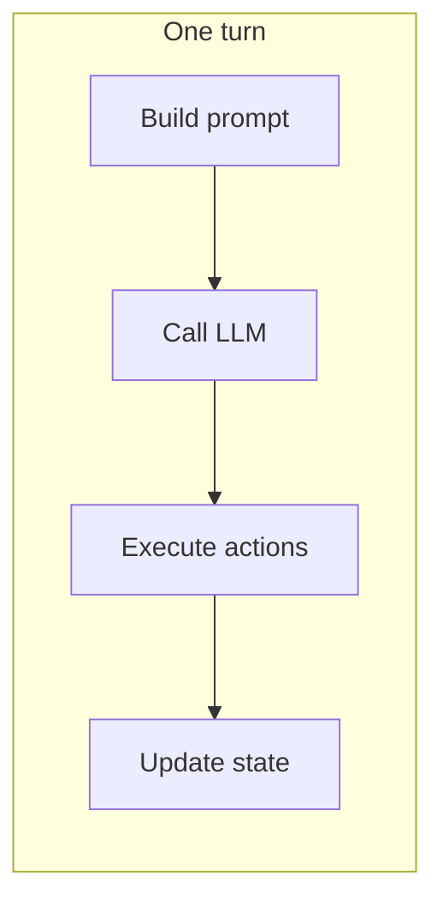
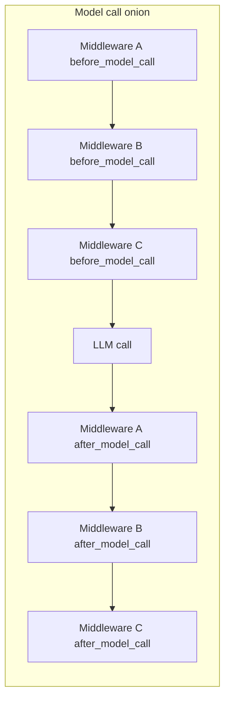

# Middleware for AI agents: decoupling behavior and extending systems safely

Modern agents are not single LLM calls. They are **loops**: choose context, call a model, interpret
structured output, dispatch tools, merge results, and repeat until the task finishes or budgets
expire. That loop naturally attracts **cross-cutting concerns**: logging, tracing, retries, output
size limits, policy checks, metrics, and error shaping. If those concerns live inside the same
functions as “what is a turn” and “how do we call the model,” every new requirement becomes a reason
to edit core agent code. Middleware is a way to **invert that dependency**: the core stays small
and stable, while behavior is composed from small, testable units.

This article explains the middleware **pattern** for agent systems, why it improves **decoupling**
and **extensibility**, and how it maps to a concrete implementation in this repository
(`src/core/middleware/`). Diagrams use [Mermaid](https://mermaid.js.org/); they render in GitHub,
many IDEs, and static site generators.

---

## 1. The problem: a growing agent loop

A minimal mental model of one **turn** looks like this:



In production, each box quietly accumulates responsibilities:

- “Log the prompt” sneaks into message building.
- “Time the model call” wraps the HTTP client inline.
- “Truncate bash output” appears inside the shell handler.
- “Catch exceptions and return a structured error” duplicates across orchestrators and workers.

The result is a **tangled loop**: business rules (what the agent is trying to accomplish) and
operational rules (how we observe and constrain execution) share the same control flow. That
coupling has predictable costs:

- **Risk**: a logging tweak can break tool execution.
- **Reuse**: you cannot reuse the same “turn engine” with different observability stacks.
- **Testing**: you must boot half the system to assert a single policy.

Middleware attacks the coupling by making the loop **explicit** and by giving cross-cutting code
**first-class hooks** instead of scattering it through call sites.

---

## 2. What “middleware” means for an agent

In web frameworks, middleware sits **around** a request handler: run code before the handler,
optionally short-circuit, then run code after the handler (many stacks unwind ``after`` hooks in
reverse registration order). Agent middleware is the same idea applied to **agent lifecycles**
rather than HTTP requests. This repository’s pipeline runs ``after_*`` in the **same** list order as
``before_*`` for predictable composition.

A useful agent middleware stack recognizes that there are **multiple scopes** inside a turn:

| Scope | Typical core work | Examples of cross-cutting work |
|-------|-------------------|--------------------------------|
| **Turn** | Build context, decide termination | session tags, budgets, global error recovery |
| **Model call** | Invoke the LLM with messages; then parse and run tools | caching, prompt guards, ``LlmResponseToolMiddleware`` in ``after_model_call`` |
| **Action** | Run a tool and return text | command logging, output truncation, allowlists |

In this project, those scopes map to context dataclass types and four lifecycle surfaces (agent task,
turn, model call, action) with paired ``before_*`` / ``after_*`` hooks on a single `Middleware` base
type. The agent copies ``ModelCallContext.execution_result`` (set when tool middleware runs in
``after_model_call``) onto ``TurnContext.result``. The pipeline guarantees **paired cleanup**: whatever
completed `before_*` without short-circuiting receives the matching `after_*` in the **same** list
order, similar to running multiple `try` / `finally` blocks in registration order.

### Code: contexts and hook surface (`base.py`)

Turn-scoped state is an ordinary dataclass mutated as middleware runs; `aborted` is the turn-level
short-circuit flag:

```24:37:src/core/middleware/base.py
@dataclass
class TurnContext:
    """Shared state passed through the middleware chain for a single turn."""
    agent_name: str
    turn_num: int
    max_turns: int
    prompt: str
    messages: List[Dict[str, str]]
    llm_response: Optional[str] = None
    result: Optional[ExecutionResult] = None
    metadata: Dict[str, Any] = field(default_factory=dict)
    aborted: bool = False
    abort_reason: Optional[str] = None
    turn_log_prefix: Optional[str] = None
```

`ModelCallContext` and `ActionCallContext` follow the same idea (`skipped` instead of `aborted`).
The `Middleware` base implements six no-op hooks; subclasses override only what they need:

```61:89:src/core/middleware/base.py
class Middleware:
    """Unified middleware base class with event-based hooks.

    Override only the events you care about; defaults are no-ops.
    """

    def before_turn(self, ctx: TurnContext) -> TurnContext:
        """Called before each turn. Set ``ctx.aborted = True`` to skip the turn."""
        return ctx

    def after_turn(self, ctx: TurnContext) -> TurnContext:
        """Called after each turn completes (including aborts and errors)."""
        return ctx

    def before_model_call(self, ctx: ModelCallContext) -> ModelCallContext:
        """Called before each LLM call. Set ``ctx.skipped = True`` to skip the call."""
        return ctx

    def after_model_call(self, ctx: ModelCallContext) -> ModelCallContext:
        """Called after each LLM call completes."""
        return ctx

    def before_action_call(self, ctx: ActionCallContext) -> ActionCallContext:
        """Called before each action. Set ``ctx.skipped = True`` to skip execution."""
        return ctx

    def after_action_call(self, ctx: ActionCallContext) -> ActionCallContext:
        """Called after each action execution completes."""
        return ctx
```

---

## 3. Mental model: nested onions per lifecycle




### Code: wiring a stack for subagents (`main.py`)

Explorer and coder share one ordered list; the orchestrator uses the same `Agent` base class but is
constructed without `middlewares`, so it gets an empty pipeline unless you add one.

```91:96:src/main.py
    subagent_middlewares = [
        LoggingMiddleware(),
        ErrorRecoveryMiddleware(),
        OutputTruncationMiddleware(max_chars=ACTION_OUTPUT_MAX_CHARS),
        TracingMiddleware(logging_dir),
    ]
```

---

## 5. How extension stays cheap

**Adding** a feature is usually:

1. Implement a class with a small override (`before_action_call`, `after_turn`, and so on).
2. Insert it into the list where its ordering guarantees are satisfied (for example, tracing that
   must see enriched metadata should run its `after_turn` last, which in this codebase is achieved by
   registering tracing **last**).
3. Leave the agent’s turn logic untouched.

**Removing** a feature is deleting one list entry. **Testing** a feature is instantiating the
middleware with a fake context object, without a live LLM.

Short-circuit flags (`aborted`, `skipped`) are the extension points for **replacing** core work:
skip the model call and inject a cached response, or skip a dangerous action. The pipeline already
defines how unwind behaves when those flags are set early.

### Code: a tiny policy-only middleware (`output_truncation.py`)

New behavior is often a single hook. Here the core tool handler still produces full output; the
middleware trims it **after** execution so the rest of the agent loop sees bounded text:

```14:21:src/core/middleware/output_truncation.py
    def after_action_call(self, ctx: ActionCallContext) -> ActionCallContext:
        if ctx.output and len(ctx.output) > self._max_chars:
            total = len(ctx.output)
            removed = total - self._max_chars
            ctx.output = ctx.output[: self._max_chars] + self.TRUNCATION_NOTICE.format(
                removed=removed, total=total
            )
        return ctx
```

